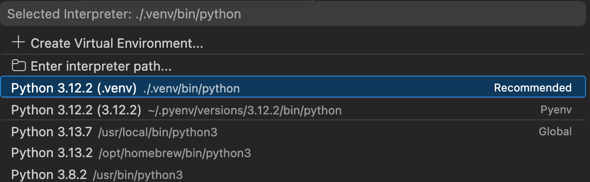
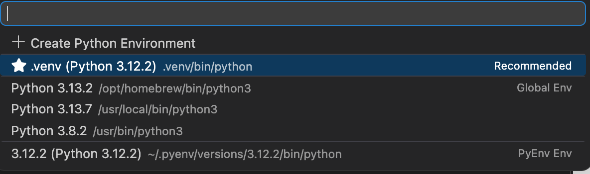

## Introduction

A virtual environment helps isolate project dependencies, avoid version conflicts, and improve reproducibility across projects. In this guide, the environment is named `.venv`, which is a common convention and works well with [Visual Studio Code](https://code.visualstudio.com/).

This guide also clarifies one of the most common sources of confusion when working with Python in VS Code:

- a **Python interpreter** is used to run regular scripts such as `.py`
- a **Jupyter kernel** is used to run notebook cells in `.ipynb` files and other notebook-based interfaces

::: {.callout-note}
## Key idea

For scripts, focus on the **Python interpreter**.

For notebooks, focus on the **Jupyter kernel**.

In both cases, the safest option is to use the Python installation inside your local `.venv`.
:::

## Prerequisites

Before starting, make sure you have installed:

- [Python](https://www.python.org/)
- [Visual Studio Code](https://code.visualstudio.com/)
- [Quarto](https://quarto.org/) if you also plan to work with `.qmd` files
- Jupyter support through packages installed inside your environment

## Key concepts

### What is `.venv`?

A `.venv` is a local Python virtual environment stored inside your project folder. It contains its own Python executable and its own installed libraries, which helps keep one project independent from another.

### Python interpreter vs. Jupyter kernel

These two concepts are related, but they are not the same.

#### Python interpreter

The **Python interpreter** is the executable that runs Python code.

Typical examples:

- `./.venv/bin/python` on macOS/Linux
- `.venv\Scripts\python.exe` on Windows

When you run a `.py` file in VS Code, the editor uses a selected **Python interpreter**.

#### Jupyter kernel

A **Jupyter kernel** is the execution engine used by notebook-based tools such as:

- Jupyter Notebook
- JupyterLab
- VS Code notebooks (`.ipynb`)
- Quarto documents with Python code cells

A Jupyter kernel is usually associated with a specific Python interpreter. In practice, you want the notebook kernel to use the Python interpreter inside your `.venv`.

::: {.callout-important}
## Practical rule

- For `.py` files, select the correct **Python interpreter**
- For `.ipynb` files, select the correct **Jupyter kernel**
- Ideally, both should point to the Python installation inside `.venv`
:::

## Step 1. Create the virtual environment

Create the environment from the root of your project.

### macOS and Linux

```bash
cd path/to/your/project
python -m venv .venv
```

### Windows

```bash
cd path\to\your\project
python -m venv .venv
```

This creates a local virtual environment named `.venv` inside the project directory.

## Step 2. Activate the virtual environment

After creating the environment, activate it in the terminal.

### macOS and Linux

```bash
source .venv/bin/activate
```

### Windows

```bash
.venv\Scripts\activate
```

If PowerShell blocks activation, use:

```powershell
Set-ExecutionPolicy -ExecutionPolicy RemoteSigned -Scope Process
.venv\Scripts\activate
```

Once activated, the terminal usually shows the environment name, for example:

```bash
(.venv)
```

::: {.callout-tip}
## Quick check

If you see `(.venv)` at the beginning of the terminal prompt, the environment is usually active.
:::

## Step 3. Install packages inside `.venv`

Once `.venv` is active, install the packages you need **inside that environment**.

### For notebooks and notebook execution

```bash
pip install ipykernel jupyter
```

### For data analysis and visualization

```bash
pip install pandas altair vega_datasets
```

### Why these packages?

- `ipykernel`: lets Jupyter-based tools execute Python using the current environment
- `jupyter`: provides notebook support
- `pandas`: data manipulation
- `altair`: declarative visualization
- `vega_datasets`: sample datasets for [Altair](https://altair-viz.github.io/)

::: {.callout-warning}
## Important

Run these commands **after** activating `.venv`. Otherwise, packages may be installed in the wrong Python environment.
:::

## Step 4. Open the project in VS Code

A good practice is to open VS Code from the project root:

```bash
code .
```

This helps VS Code detect the project structure and the local `.venv`.

## Step 5. Select the Python interpreter in VS Code

For regular Python scripts such as `.py`, select the interpreter from the local `.venv`.

### Typical interpreter path

- **macOS/Linux**: `./.venv/bin/python`
- **Windows**: `.venv\Scripts\python.exe`

### In VS Code

1. Open the Command Palette
    - **macOS**: `Cmd + Shift + P`
    - **Windows/Linux**: `Ctrl + Shift + P`
2. Run `Python: Select Interpreter`
3. Choose the interpreter from `.venv`

{width="80%" fig-alt="VS Code interpreter selection"}

::: {.callout-note}
## Remember

Selecting the interpreter is especially relevant for `.py` files. It does not automatically guarantee that a notebook will use the same environment.
:::

## Step 6. Use notebooks correctly in VS Code

When working with notebooks (`.ipynb`), VS Code uses a **Jupyter kernel**, not just the interpreter selector.

### Best case: `.venv` is detected automatically

Sometimes VS Code detects the environment automatically and lets you use it directly as a notebook kernel.

If that happens:

1. Open the notebook
2. Click **Select Kernel**
3. Choose the option associated with `.venv`

{width="80%" fig-alt="VS Code kernel selection"}

### If `.venv` is not available as a kernel

Register the environment manually as a Jupyter kernel:

```bash
python -m ipykernel install --user --name=project-viz-env --display-name="Python viz (.venv)"
```

### Meaning of the command

- `python`: uses the currently active interpreter, ideally the one inside `.venv`
- `-m ipykernel install`: registers a Jupyter kernel
- `--user`: installs it only for the current user
- `--name`: internal kernel name
- `--display-name`: visible label in VS Code or JupyterLab

After this, the kernel should appear in notebook interfaces.

::: {.callout-tip}
## Tip

Manual kernel registration is useful when VS Code does not detect `.venv` automatically. In many cases, automatic detection works and manual registration is not necessary.
:::

## Step 7. Select the Jupyter kernel in VS Code

For a notebook:

1. Open the `.ipynb` file
2. Click **Select Kernel**
3. Choose the kernel associated with your `.venv`

If you registered it manually, it may appear with a display name such as:

`Python viz (.venv)`

Then the notebook will execute cells using the project environment.

## Step 8. Verify that the notebook is using `.venv`

Inside a notebook cell, run:

```python
import sys
print(sys.executable)
```

You want to see a path pointing to your local `.venv`, such as:

```bash
.../your-project/.venv/bin/python
```

If it points to a global Python instead, then the notebook is using the wrong kernel.

::: {.callout-important}
## Why this matters

A notebook may open correctly and still use the wrong environment. Checking `sys.executable` is a simple way to confirm that the notebook is really running from `.venv`.
:::

## Step 9. Deactivate the environment

When you finish working in the terminal, deactivate the environment with:

```bash
deactivate
```

This exits the virtual environment and returns to the default shell Python.

## Common mistakes

### Mistake 1. Confusing interpreter and kernel

A Python interpreter and a Jupyter kernel are related, but not identical.

- Scripts use an interpreter
- Notebooks use a kernel
- The kernel should ideally use the interpreter from `.venv`

### Mistake 2. Installing packages outside `.venv`

Always activate `.venv` before running `pip install ...`.

### Mistake 3. Assuming VS Code always detects `.venv`

Often it does, but not always. Manual kernel registration is optional, not mandatory.

### Mistake 4. Clicking **Install** for the wrong Python

If VS Code says something like “Running cells with Python X requires `ipykernel`”, first check whether that Python is really your `.venv`.

## Recommended workflow

1. Create `.venv`
2. Activate `.venv`
3. Install required packages
4. Open the project in VS Code
5. Select the interpreter for `.py` files
6. Select the Jupyter kernel for `.ipynb` files
7. Register the kernel only if automatic detection fails

## Final note

::: {.callout-note}
## Good practice

Use `.venv` as the default environment for each project. This keeps dependencies isolated and makes both scripts and notebooks more reproducible.
:::
