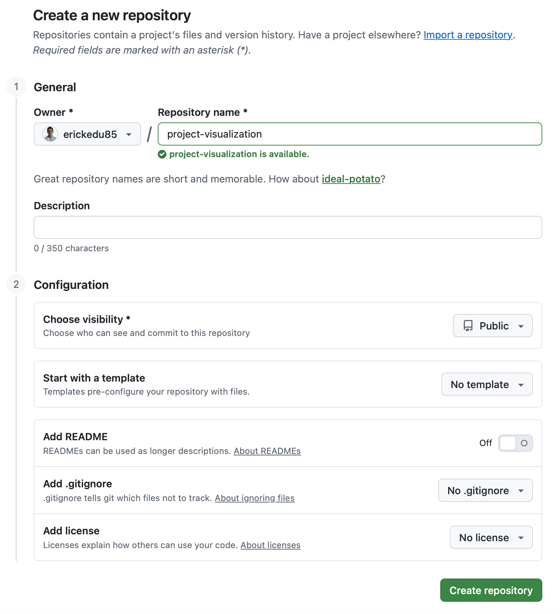

## Introduction

[Git](https://git-scm.com/) is a distributed version control system used to track changes in source code and collaborate efficiently. It is especially useful in programming, research, and data science projects because it preserves the history of changes, supports rollback, and improves reproducibility.

In a typical project workflow, Git helps you:

- track the history of changes
- collaborate more safely
- recover previous versions if needed
- keep experiments and project evolution organized

::: {.callout-note}
## Why Git matters

Git is not only for software engineering. It is also highly valuable in research, data science, academic projects, and technical documentation because it improves traceability and reproducibility.
:::

## Prerequisites

Before starting, make sure you have:

- [Git](https://git-scm.com/) installed on your computer
- [Visual Studio Code](https://code.visualstudio.com/) or another code editor
- a project folder already created
- a [GitHub](https://github.com/) account if you want to publish the repository online

## Step 1. Create a `.gitignore` file

A `.gitignore` file tells Git which files and folders should **not** be tracked.

This is important for keeping the repository clean and avoiding unnecessary or machine-specific files.

Create the file from the root of your project:

```bash
touch .gitignore
```

Then add rules such as the following:

```gitignore
# Python
.venv/
__pycache__/
*.pyc

# Environment variables
.env

# macOS
.DS_Store

# Jupyter
.ipynb_checkpoints/

# Quarto
_site/
.quarto/
/.quarto/
*_files/
```

### Why is `.gitignore` important?

- prevents committing unnecessary or large files
- avoids uploading virtual environments such as `.venv`
- keeps the repository cleaner and lighter
- improves portability across machines

::: {.callout-important}
## Best practice

Create `.gitignore` **before** running `git init`, so the repository starts clean from the beginning.
:::

## Step 2. Initialize Git locally

Once the project folder is ready and `.gitignore` has been created, initialize Git in the project directory.

```bash
git init
```

This turns your folder into a local Git repository.

### Add files to staging

```bash
git add .
```

This stages all project files except those excluded by `.gitignore`.

### Create the first commit

```bash
git commit -m "Initial clean commit"
```

This saves the first snapshot of your project history.

### Check repository status

Before committing, it is a good habit to verify what Git is about to include:

```bash
git status
```

::: {.callout-tip}
## Recommended workflow

A simple initial workflow is:

1. create `.gitignore`
2. run `git init`
3. verify files with `git status`
4. stage files with `git add .`
5. create a commit with `git commit`
:::

## Step 3. Create the repository on GitHub

To publish your project online, create a new repository on [GitHub](https://github.com/new).

Recommended configuration:

- **Repository name**: choose a meaningful name, for example `project-visualization`
- **Visibility**: `Public` or `Private`
- **Do not initialize with README**: this helps avoid unnecessary merge conflicts when linking an existing local project

After that, click **Create repository**.

{width="80%"}

## Step 4. Link the local repository to GitHub

After creating the remote repository on GitHub, connect your local project to it.

```bash
git remote add origin https://github.com/USUARIO/proyecto-visualizacion.git
git branch -M main
git push -u origin main
```

### Meaning of each command

- `git remote add origin ...`: links the local repository to the remote repository on GitHub
- `git branch -M main`: renames the default branch to `main`
- `git push -u origin main`: uploads the project and sets the remote tracking branch

::: {.callout-note}
## Replace placeholder values

Before running the command, replace `USUARIO` and `proyecto-visualizacion` with your real GitHub username and repository name.
:::

## Common mistakes

### Mistake 1. Creating `.gitignore` too late

If you run `git init` and stage files before creating `.gitignore`, unnecessary files may already be tracked.

### Mistake 2. Uploading `.venv`

A virtual environment should usually stay local. Do not include `.venv/` in your repository.

### Mistake 3. Forgetting to check `git status`

Committing without reviewing the status can lead to accidental uploads of unwanted files.

### Mistake 4. Initializing the GitHub repository with a README

If your local project already exists, initializing the remote repository with a README can introduce avoidable merge conflicts.

## Recommended flow

Use this sequence for a clean first setup:

```{mermaid}
flowchart TD
    A[Create project folder] --> B[Create .gitignore]
    B --> C[Run git init]
    C --> D[Check git status]
    D --> E[Run git add .]
    E --> F[Create first commit]
    F --> G[Create repository on GitHub]
    G --> H[Link remote origin]
    H --> I[Push to main]
```

## Final note

Git becomes much more useful when used consistently from the start of a project. Even in small academic or personal projects, it helps maintain order, traceability, and reproducibility.

::: {.callout-tip}
## Final recommendation

For projects in Python, Jupyter, or Quarto, always review your `.gitignore` carefully before the first commit. This small step prevents many common repository problems later.
:::
