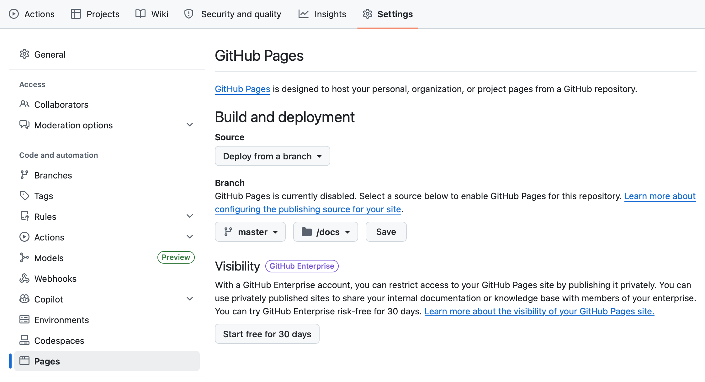

## Introduction

[GitHub Pages](https://pages.github.com/) is a free static hosting service provided by GitHub. It allows you to publish websites directly from a repository, which makes it especially useful for Quarto reports, project websites, and student portfolios.

In a typical workflow, you first prepare and push your project to GitHub, and then configure GitHub Pages from the repository settings so the site becomes publicly accessible.

::: {.callout-note}
## Typical use cases

According to the source material, common uses of GitHub Pages include:

- Quarto reports and websites
- Student portfolios
:::

## Prerequisites

Before enabling GitHub Pages, make sure you have:

- a GitHub repository already created
- your project pushed to GitHub
- a Quarto project or other static content ready to publish
- a clear output folder strategy, such as publishing from `docs/`

::: {.callout-tip}
## Good practice

If your project is built with Quarto, it is common to configure the rendered site so the final output is written to a publishable folder such as `docs/`.
:::

## Step 1. Open your repository on GitHub

Go to the GitHub repository that contains the project you want to publish. The GitHub Pages configuration starts from the repository interface.

## Step 2. Open the repository settings

Inside the repository:

1. Click **Settings**
2. In the left sidebar, scroll down
3. Click **Pages**

These are the configuration steps indicated in the source material.

{width="80%" fig-alt="GitHub repository settings and Pages menu"}

## Step 3. Choose the publishing source

Under **Source**, configure the repository publishing options.

The source material indicates the following setup:

- **Branch**: `main` 
- or `master` if that is your default branch
- **Folder**: `/ (docs)`

Then click **Save**.

::: {.callout-important}
## Important

Make sure the selected branch matches the branch you are actually using in the repository. In many projects this is `main`, but some repositories may still use `master`.
:::

## Step 4. Wait for GitHub to publish the site

After saving the Pages configuration, GitHub will generate a public link after a short delay. The source indicates that this usually takes a few minutes.

A typical published URL looks like this:

```text
https://<your-username>.github.io/<repository-name>/
```

## How this fits with Quarto

A common workflow for Quarto projects is:

1. Write and render your `.qmd` files
2. Make sure the generated site is placed in the folder you plan to publish
3. Push the repository to GitHub
4. Enable GitHub Pages from the repository settings
5. Share the generated public URL

::: {.callout-tip}
## Suggested project logic

If you are building a small course website or technical documentation site, keeping the rendered output in `docs/` can simplify publishing with GitHub Pages.
:::

## Common mistakes

### Mistake 1. Selecting the wrong branch

If GitHub Pages is configured to publish from `main` but your content is on another branch, the site will not publish correctly.

### Mistake 2. Selecting the wrong folder

If Pages is configured to use `/ (docs)`, but the rendered site is not inside `docs/`, GitHub will not find the expected files.

### Mistake 3. Expecting the site to appear instantly

GitHub Pages may take a few minutes to generate and expose the public link. fileciteturn1file0L17-L20

### Mistake 4. Forgetting to push changes

Local changes do not affect GitHub Pages until they are committed and pushed to the repository.

## Recommended workflow

To keep the process simple and reproducible:

1. Keep your project under Git version control
2. Push the latest version to GitHub
3. Configure GitHub Pages from **Settings > Pages**
4. Publish from the correct branch and folder
5. Test the public URL after deployment

## Final note

GitHub Pages is a simple and effective way to publish static academic and technical content for free. For Quarto users, it is especially useful for sharing reports, course materials, and small websites directly from a GitHub repository.
