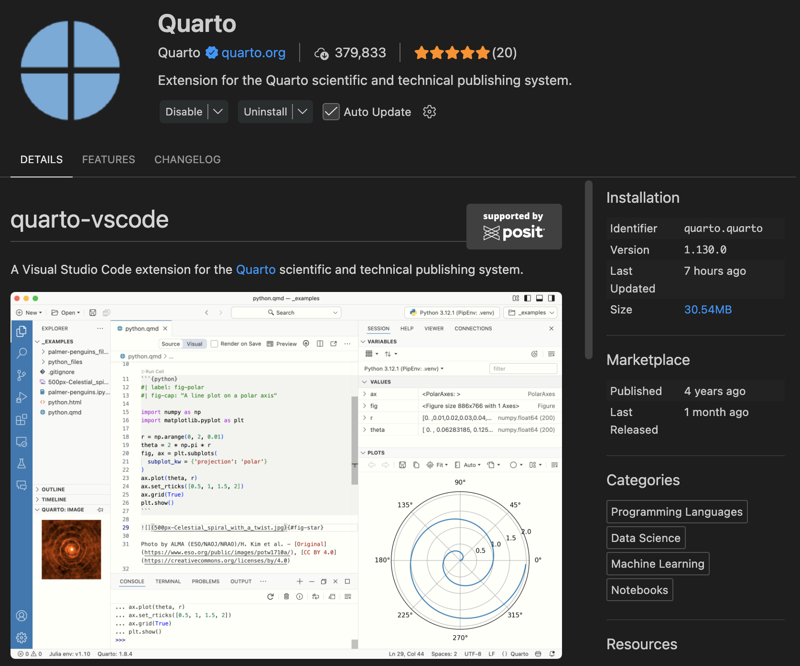

## Introduction

[Quarto](https://quarto.org/) is an open-source publishing system for technical and scientific communication. It allows you to combine narrative text, executable code, and outputs such as figures, tables, and interactive content in a single reproducible document.

A Quarto document typically uses the `.qmd` extension and can be rendered to multiple formats, including HTML, PDF, slides, dashboards, and books.

::: {.callout-note}
## Why Quarto is useful

Quarto is especially useful when you want to keep **text, code, and results** together in one place and generate polished outputs from the same source file.
:::

## What Quarto is used for

Quarto can be used to create:

- HTML pages and websites
- PDF reports
- slide presentations
- dashboards
- books
- technical documentation
- reproducible analysis reports

It supports narrative writing in Markdown together with code in languages such as Python, R, and Julia.

## Prerequisites

Before starting, make sure you have:

- [Visual Studio Code](https://code.visualstudio.com/) installed
- permission to install software on your computer
- access to a terminal

If you plan to execute Python code inside Quarto documents, you should also have [Python](https://www.python.org/) installed.

## Step 1. Install Quarto

To install Quarto:

1. Go to the [official Quarto website](https://quarto.org/).
2. Open the installation or getting started section.
3. Select your operating system.
4. Download the installer.
5. Run the installer and complete the setup process.

After installation, verify it from the terminal with:

```bash
quarto check
quarto --version
```

If Quarto was installed correctly, these commands should display the installed version and system configuration.

::: {.callout-tip}
## Tip

Use both commands after installation:

- `quarto --version` confirms that Quarto is available
- `quarto check` helps detect configuration problems
:::

## Step 2. Install the Quarto extension in VS Code

Once Quarto is installed, enable support in [VS Code](https://code.visualstudio.com/) by installing the Quarto extension.

### In VS Code

1. Open VS Code
2. Open the Extensions panel
3. Search for `Quarto`
4. Install the extension published by the **Quarto Dev Team**
5. Restart VS Code if needed

This extension provides features such as:

- syntax highlighting for `.qmd` files
- preview and render integration
- editor support for Quarto projects

{width="80%" fig-alt="Quarto extension in VS Code"}

## Step 3. Verify that Quarto works in VS Code

After installing the extension:

1. Open a Quarto document with extension `.qmd`
2. Check whether a **Render** or **Preview** button appears in the editor
3. Try previewing or rendering the document directly from VS Code

If those features are available, then Quarto is correctly integrated with VS Code.

::: {.callout-important}
## Important

If Quarto works in the terminal but not in VS Code, the problem is often related to the editor integration, the extension state, or the current file type.
:::

## Step 4. Create a minimal test document

A simple test file can be:

```markdown
---
title: "My first Quarto document"
format: html
---

# Hello Quarto

This is my first Quarto page.
```

Save the file as:

```text
test.qmd
```

Then render it using one of these options:

- the **Render** button in VS Code
- the **Preview** button in VS Code, if available
- the terminal with:

```bash
quarto render test.qmd
```

## Step 5. Understand render vs. preview

These two actions are related, but they are not the same.

### Render

`quarto render` generates the output file, for example an HTML page.

### Preview

`quarto preview` starts a local preview server and lets you inspect changes while you edit the document.

Example:

```bash
quarto preview test.qmd
```

::: {.callout-note}
## Key idea

Use **render** when you want the final output.

Use **preview** when you want to edit and inspect changes interactively.
:::

## Recommended verification checklist

Before starting to work seriously with Quarto, confirm all of the following:

- `quarto --version` works in the terminal
- `quarto check` runs without critical errors
- the Quarto extension is installed in VS Code
- `.qmd` files open correctly in the editor
- the **Render** or **Preview** button appears
- a simple `.qmd` file renders successfully

## Common issues

### Quarto command not found

If the terminal says `quarto: command not found`, Quarto is probably not installed correctly or is not available in your system `PATH`.

### VS Code does not show Render or Preview

Possible causes include:

- the Quarto extension is not installed
- VS Code needs to be restarted
- the file is not saved with extension `.qmd`
- the current workspace has not refreshed correctly

### Quarto is installed but preview does not work

Check the following:

- the file has valid YAML at the top
- the Quarto extension is enabled
- the document does not contain syntax errors
- Quarto works correctly from the terminal

::: {.callout-warning}
## Common mistake

Do not assume that Quarto is broken just because preview fails inside VS Code. Always verify first whether `quarto render` or `quarto preview` works from the terminal.
:::

## Recommended workflow

1. Install Quarto
2. Verify the installation in the terminal
3. Install the Quarto extension in VS Code
4. Open a `.qmd` file
5. Check for **Render** or **Preview** in the editor
6. Create and test a minimal Quarto document
7. Use `quarto render` or `quarto preview` as needed

## Final note

Quarto becomes especially useful when combined with reproducible workflows in VS Code, because it allows you to keep code, text, and outputs together in a single document.

As your projects grow, you can extend the same workflow to websites, reports, presentations, and course materials built from `.qmd` files.
